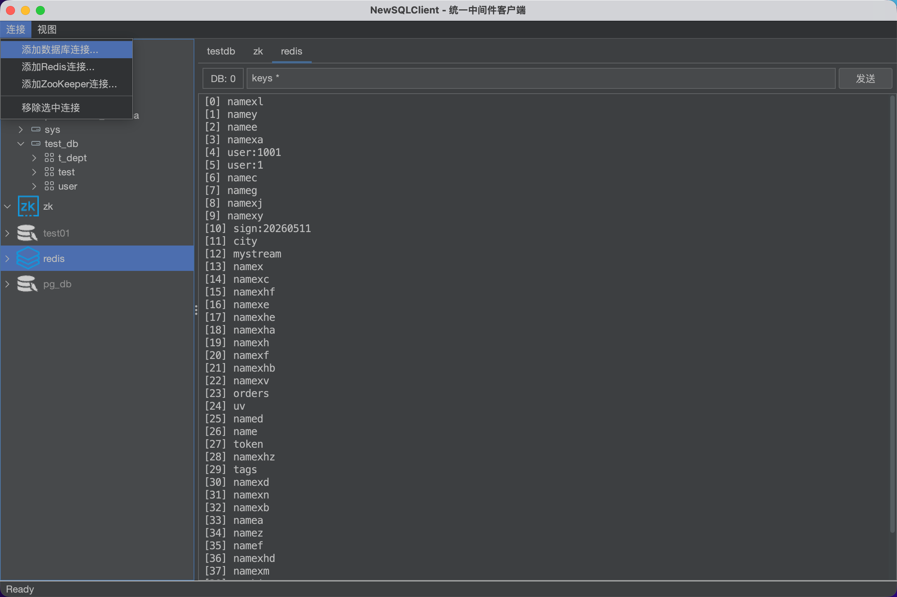
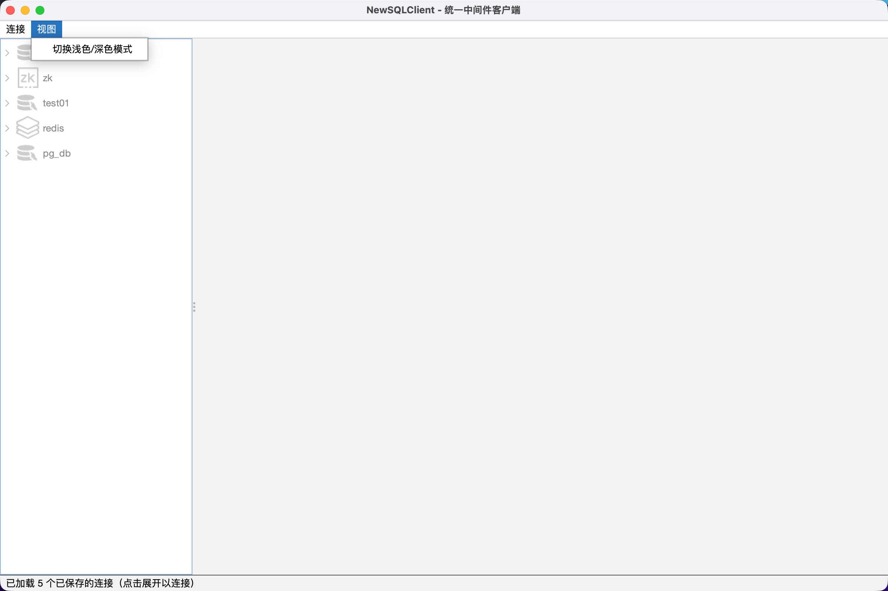
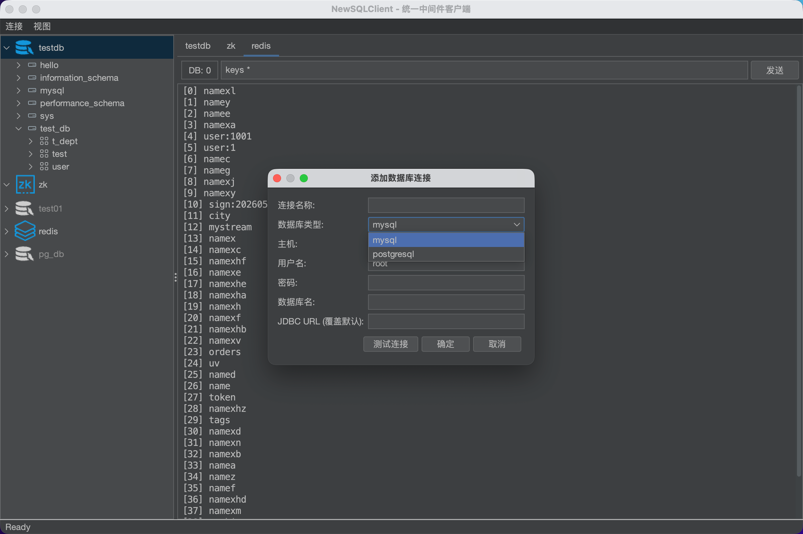
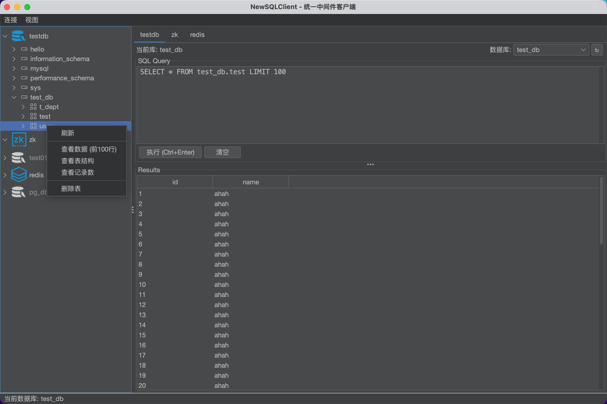
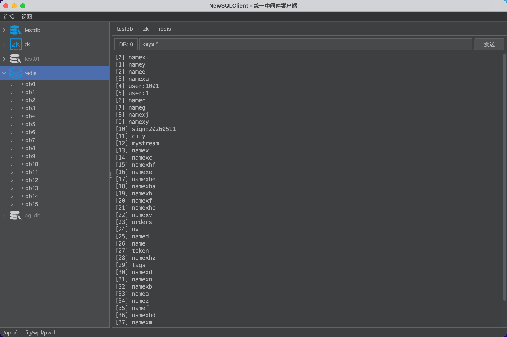
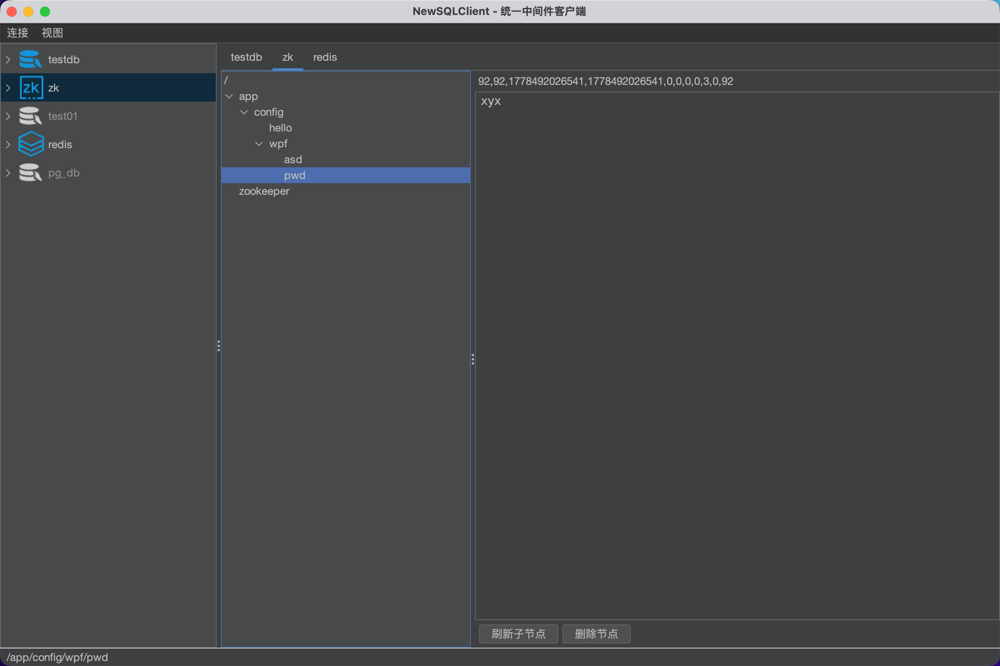

# NewSQLClient

基于 AI 开发的一体化中间件聚合客户端，当前已支持 MySQL、PostgreSQL、Redis、Zookeeper 等主流中间件连接，后续将持续扩展 Elasticsearch、MongoDB、MQ 等生态组件；采用统一化交互布局设计，支持浅色/深色主题切换，提升开发与运维效率。
---

# 项目特点

- 支持 MySQL / PostgreSQL 数据库管理
- 支持 Redis 可视化管理
- 支持 Zookeeper 节点管理
- 统一化客户端布局
- 支持浅色 / 深色主题
- AI 辅助开发
- Java 桌面客户端
- 支持跨平台运行（Windows / Linux / macOS）
- 后续持续扩展 Elasticsearch / MongoDB / MQ 等中间件

---


## 运行截图
Themes
------------



MySQL
------------



Redis
------------



Zookeeper
------------


## 环境要求

- Java 17+
- Maven 3.9+

## 快速开始

```bash
# 编译
mvn compile

# 运行
mvn exec:java
```

### 运行方式

[项目提供可执行 Jar 包](/images/NewSQLClient-0.1.jar)：

```bash
java -jar NewSQLClient-0.1.jar
```

## 功能概览

### 数据库 (MySQL / PostgreSQL)

- 连接管理：添加、测试、断开、重新连接
- 浏览数据库/模式/表/列结构
- SQL 编辑器（语法高亮、Ctrl+Enter 执行）
- 查询结果分页（支持 20/50/100/200/500/1000 行每页）
- 表操作：查看数据、查看结构、查看记录数、删除表
- MySQL：新建数据库（CREATE DATABASE）
- PostgreSQL：新建模式（CREATE SCHEMA）、自动过滤系统 schema
- 新建表（可视化列设计器，支持主键、自增、非空等约束）
- 连接配置持久化（JSON 文件保存）

### Redis

- 连接管理：添加、测试、断开、重新连接
- 16 个数据库切换（db0 - db15）
- 合并输入框：输入 key 名查看详情，输入命令直接执行
- 支持所有 Redis 命令（通过 Jedis sendCommand）
- 返回数据反序列化展示（String/List/Set/Hash/byte[] 等）

### ZooKeeper

- 连接管理：添加、测试、断开、重新连接
- 左侧目录树：单击展开子节点，自动加载数据
- 节点数据查看（get + stat）
- 删除节点（支持级联删除）
- 手动刷新子节点

### 通用功能

- 浅色/深色模式切换（菜单栏 → 视图）
- 连接树自定义图标（MySQL/Redis/ZK 区分连接/断开状态）
- 重启自动保存连接配置

## 项目结构

```
src/main/java/com/newsqlclient/
├── App.java                         # 入口
├── core/
│   ├── ConnectionInfo.java          # 连接信息 POJO
│   ├── ConnectionManager.java       # 连接管理器
│   └── connector/
│       ├── Connector.java           # 统一连接接口
│       ├── DatabaseConnector.java   # JDBC + HikariCP
│       ├── RedisConnector.java      # Jedis
│       └── ZookeeperConnector.java  # Curator
├── model/
│   └── TreeNode.java               # 树节点模型
├── ui/
│   ├── MainFrame.java              # 主窗口
│   ├── ConnectionTree.java         # 连接树（懒加载、右键菜单）
│   ├── TabbedWorkArea.java         # Tab 页工作区
│   ├── StatusBar.java              # 状态栏
│   ├── dialog/
│   │   ├── DatabaseConnDialog.java # 数据库连接对话框
│   │   ├── RedisConnDialog.java    # Redis 连接对话框
│   │   ├── ZkConnDialog.java       # ZK 连接对话框
│   │   └── CreateTableDialog.java  # 建表对话框（列设计器）
│   └── panel/
│       ├── DatabasePanel.java      # SQL 编辑器 + 分页结果
│       ├── RedisPanel.java         # Redis 命令输入 + 结果展示
│       └── ZkPanel.java           # ZK 节点树 + 数据查看
└── util/
    ├── ConfigStore.java            # 连接配置 JSON 持久化
    ├── SwingUtils.java             # UI 工具
    └── ThemeManager.java           # 浅色/深色主题管理
```

## 依赖

| 依赖 | 用途 |
|------|------|
| FlatLaf | 现代化 Swing 主题（浅色/深色） |
| MySQL Connector/J | MySQL JDBC 驱动 |
| PostgreSQL JDBC | PostgreSQL JDBC 驱动 |
| SQLite JDBC | SQLite JDBC 驱动 |
| HikariCP | 数据库连接池 |
| Jedis | Redis 客户端 |
| Apache Curator | ZooKeeper 客户端 |
| Jackson | JSON 序列化 |
